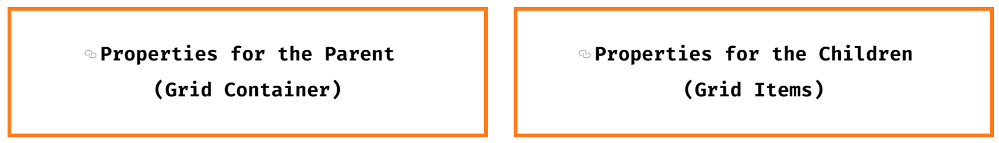
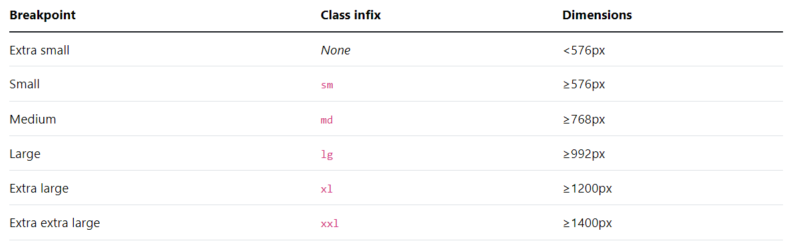
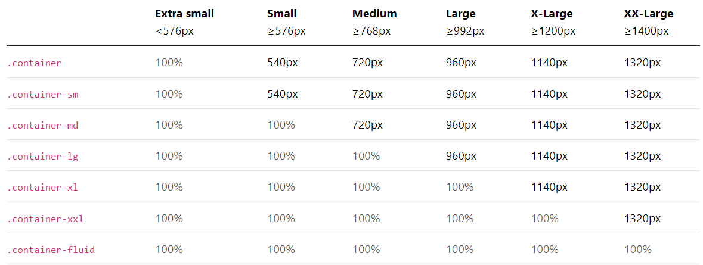
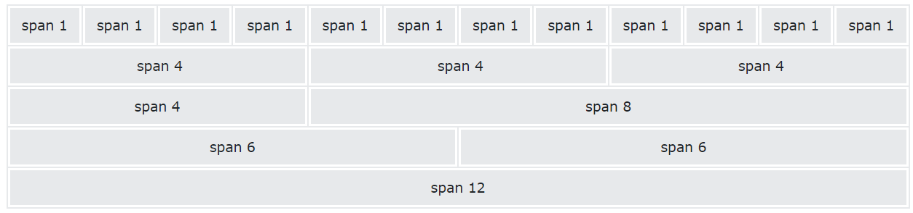
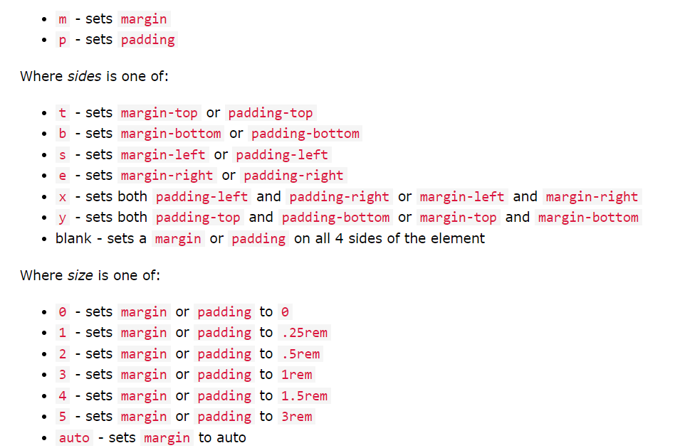
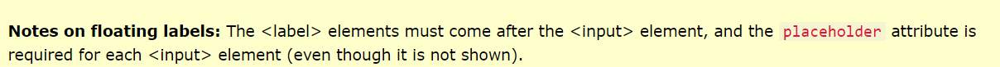

# Topics

- [CSS Grid](#css-grid)
  - [CSS Grid Container](#css-grid-container)
  - [CSS Grid Item](#css-grid-item)
  - [Others](#others)
- [CSS Text](#css-text)
- [CSS Math Functions](#css-math-functions)

  <br>

- [Bootstrap 5](#bootstrap-5)
  - [How to use bootstrap?](#how-to-use-bootstrap)
  - [File Structure](#file-structure)
  - [Contents](#contents)
  - [Customization](#customization)
  - [Layouts](#layouts) (Containers, Breakpoints)
  - [Utilities](#utilities)
  - [Components](#components) (Offcanvas, Floating Labels)
  - [Bootstrap Approach](#bootstrap-approach)
  - [Comparison](#comparison)
    <br>
- [References](#references)
  <br>
  <br>

## CSS Grid

Link: https://css-tricks.com/snippets/css/complete-guide-grid/</small>

CSS Grid Layout (aka “Grid” or “CSS Grid”), is a two-dimensional grid-based layout system.
<br>



```html
<div class="container">
	<div class="item">1</div>
	<div class="item">2</div>
	<div class="item">3</div>
	<div class="item">4</div>
	<div class="item">5</div>
	<div class="item">6</div>
	<div class="item">7</div>
	<div class="item">8</div>
	<div class="item">9</div>
</div>
```


<br><br>

### CSS Grid Container

```css
.container {
    display: grid | inline-grid;
    grid-template-columns: ...  ...;
    /* e.g.
        1fr 1fr
        minmax(10px, 1fr) 3fr
        repeat(5, 1fr)
        50px auto 100px 1fr
    */
    grid-template-rows: ... ...;
    /* e.g.
        min-content 1fr min-content
        100px 1fr max-content
    */

    grid-template: <grid-template-areas> | <grid-template-rows> / <grid-template-columns>;
    grid-template-areas: “h h h h h”
		         “a a . a a”

    column-gap: 20px;
    row-gap: 20px;
    gap: <row-gap>  <column-gap>;


    justify-items: start | end | center | stretch;
    align-items: start | end | center | stretch;
    place-items: <align-items> / <justify-items>;
    /*  If the second value is omitted, the first value is assigned to both properties. */

    justify-content: start | end | center | stretch | space-around | space-between |space-evenly;
    align-content: start | end | center | stretch | space-around | space-between | space-evenly;
    place-content: <align-content> / <justify-content>;

    grid-auto-columns: 60px;
    grid-auto-rows: 40px;
    grid-auto-flow: row | column | row dense | column dense;

}

```

🔼 [Back to Top](#topics)

<br>

### CSS Grid Item

```css
.item1 {
	grid-column-start: <number> | <name> | span <number> | span <name> | auto;
	grid-column-end: <number> | <name> | span <number> | span <name> | auto;
	grid-row-start: <number> | <name> | span <number> | span <name> | auto;
	grid-row-end: <number> | <name> | span <number> | span <name> | auto;
	/* If no grid-column-end/grid-row-end is declared, the item will span 1 track by default. */

	grid-column: 1 / 3;
	grid-row: 1 / span 2;

	grid-area: <name> | <row-start> / <column-start> / <row-end> / <column-end>;

	justify-self: start | end | center | stretch;
	align-self: start | end | center | stretch;
	place-self: <align-self> / <justify-self>; /* center stretch; */
}
```

🔼 [Back to Top](#topics)
<br>

### Others

<strong>Sizing Keywords:</strong> <kbd>min-content | max-content | auto | fr</kbd>

<strong>Sizing Functions:</strong> <kbd>fit-content() | minmax() | repeat() </kbd>

Link: <a href="https://css-tricks.com/auto-sizing-columns-css-grid-auto-fill-vs-auto-fit/" target="_blank">`auto-fill` vs `auto-fit`</a>

```css
grid-template-columns: repeat(8, minmax(10px, 1fr));
grid-template-columns: repeat(auto-fit, minmax(250px, 1fr));

/* auto-fill | auto-fit */
```

🔼 [Back to Top](#topics)

<br>
<br>

## CSS Text

Link: https://www.w3schools.com/css/css_text.asp

### Text Color

<a href="https://coolors.co/contrast-checker/030a13-ddd71a" target="_blank">Color Contrast Checker</a>

### Text Alignment

- <code><span style="color:red;">text-align</span></code>
- <code><span style="color:red;">text-align-last</span></code>
- <code><span style="color:red;">vertical-align</span></code>

### Text Decoration

- <code><span style="color:red;">text-decoration-line</span></code>
- <code><span style="color:red;">text-decoration-color</span></code>
- <code><span style="color:red;">text-decoration-style</span></code>
- <code><span style="color:red;">text-decoration-thickness</span></code>
- <code><span style="color:red;">text-decoration</span></code>

### Text Transformation

- <code><span style="color:red;">text-transform</span></code>

### Text Spacing

- <code><span style="color:red;">text-indent</span></code>
- <code><span style="color:red;">letter-spacing</span></code>
- <code><span style="color:red;">line-height</span></code>
- <code><span style="color:red;">word-spacing</span></code>
- <code><span style="color:red;">white-space</span></code>

### Text Shadow

- <code><span style="color:red;">text-shadow:</span> horizontal vertical blur color</code>

### Text Effects <small>https://www.w3schools.com/css/css3_text_effects.asp</small>

- <code><span style="color:red;">text-overflow</span></code>
- <code><span style="color:red;">word-wrap</span></code>
- <code><span style="color:red;">word-break</span></code>
- <code><span style="color:red;">writing-mode</span></code>

🔼 [Back to Top](#topics)
<br>
<br>

## CSS Math Functions

Link: https://www.w3schools.com/css/css_math_functions.asp

- <code><span style="color:red;">calc()</span></code>
- <code><span style="color:red;">min()</span></code>
- <code><span style="color:red;">max()</span></code>

<br>
<br>

# Bootstrap 5

Bootstrap is a powerful, feature-packed frontend framework.

- Bootstrap 5 is the newest version of [Bootstrap](https://www.w3schools.com/bootstrap/default.asp).
- The main differences between Bootstrap 5 and Bootstrap 3 & 4, is that Bootstrap 5 has switched to [JavaScript](https://www.w3schools.com/js/default.asp) instead of [jQuery](https://www.w3schools.com/jquery/default.asp).
- The biggest difference between Bootstrap 3 and Bootstrap 4 & 5 is that Bootstrap 5 now uses flexbox, instead of floats, to handle the layout.
- **Browser compatibility:** Bootstrap 5 is compatible with all modern browsers (Chrome, Firefox, Edge, Safari, and Opera). 
  **Note:** If you need support for IE11 and down, you must use either BS4 or BS3.
- **If you require IE8-9 support, use [Bootstrap 3.](https://www.w3schools.com/bootstrap/default.asp)**

<br>

### How to use Bootstrap?

- Include via CDN

```html
<link
	href="https://cdn.jsdelivr.net/npm/bootstrap@5.3.3/dist/css/bootstrap.min.css"
	rel="stylesheet"
	integrity="sha384-QWTKZyjpPEjISv5WaRU9OFeRpok6YctnYmDr5pNlyT2bRjXh0JMhjY6hW+ALEwIH"
	crossorigin="anonymous"
/>
<script
	src="https://cdn.jsdelivr.net/npm/bootstrap@5.3.3/dist/js/bootstrap.bundle.min.js"
	integrity="sha384-YvpcrYf0tY3lHB60NNkmXc5s9fDVZLESaAA55NDzOxhy9GkcIdslK1eN7N6jIeHz"
	crossorigin="anonymous"
></script>
```

- Install via package manager

```html
npm install bootstrap@5.3.3
```

🔼 [Back to Top](#topics)

<br>

### File Structure

```
your-project/
├── scss/
│   └── custom.scss
└── node_modules/
│   └── bootstrap/
│       ├── js/
│       └── scss/
└── index.html
```

🔼 [Back to Top](#topics)

<br>

### Contents

```
bootstrap/
├── css/
│   ├── bootstrap-grid.css
│   ├── bootstrap-grid.css.map
│   ├── bootstrap-grid.min.css
│   ├── bootstrap-grid.min.css.map
│   ├── bootstrap-grid.rtl.css
│   ├── bootstrap-grid.rtl.css.map
│   ├── bootstrap-grid.rtl.min.css
│   ├── bootstrap-grid.rtl.min.css.map
│   ├── bootstrap-reboot.css
│   ├── bootstrap-reboot.css.map
│   ├── bootstrap-reboot.min.css
│   ├── bootstrap-reboot.min.css.map
│   ├── bootstrap-reboot.rtl.css
│   ├── bootstrap-reboot.rtl.css.map
│   ├── bootstrap-reboot.rtl.min.css
│   ├── bootstrap-reboot.rtl.min.css.map
│   ├── bootstrap-utilities.css
│   ├── bootstrap-utilities.css.map
│   ├── bootstrap-utilities.min.css
│   ├── bootstrap-utilities.min.css.map
│   ├── bootstrap-utilities.rtl.css
│   ├── bootstrap-utilities.rtl.css.map
│   ├── bootstrap-utilities.rtl.min.css
│   ├── bootstrap-utilities.rtl.min.css.map
│   ├── bootstrap.css
│   ├── bootstrap.css.map
│   ├── bootstrap.min.css
│   ├── bootstrap.min.css.map
│   ├── bootstrap.rtl.css
│   ├── bootstrap.rtl.css.map
│   ├── bootstrap.rtl.min.css
│   └── bootstrap.rtl.min.css.map
└── js/
    ├── bootstrap.bundle.js
    ├── bootstrap.bundle.js.map
    ├── bootstrap.bundle.min.js
    ├── bootstrap.bundle.min.js.map
    ├── bootstrap.esm.js
    ├── bootstrap.esm.js.map
    ├── bootstrap.esm.min.js
    ├── bootstrap.esm.min.js.map
    ├── bootstrap.js
    ├── bootstrap.js.map
    ├── bootstrap.min.js
    └── bootstrap.min.js.map
```

🔼 [Back to Top](#topics)

<br>

### Customization

```scss
// Custom.scss
// Option A: Include all of Bootstrap

// Include any default variable overrides here (though functions won't be available)

@import "../node_modules/bootstrap/scss/bootstrap";

// Then add additional custom code here
```

<br>

```js
# Install Sass globally
npm install -g sass

# Watch your custom Sass for changes and compile it to CSS
sass --watch ./scss/custom.scss ./css/custom.css
```

Now change $primary in custom.scss file and see the customized output.
🔼 [Back to Top](#topics)
<br>

## Layouts

### Breakpoints


<br>

### Containers

The <code>max-width</code> of the container will change on different screen sizes/viewports:

<br>

### Grid

Link: https://www.w3schools.com/bootstrap5/bootstrap_grid_basic.php


🔼 [Back to Top](#topics)
<br>

## Utilities


🔼 [Back to Top](#topics)

### Dark Mode

If you want to change the whole page to a darker color, you can add <code><span style="color: red;">data-bs-theme="dark"</span></code> to the <html> element.

```html
<html lang="en" data-bs-theme="dark">
	<body>
		<!-- Table will get dark theme only -->
		<table class="table" data-bs-theme="dark"></table>
	</body>
</html>
```

<br>

## Components

### Offcanvas

Offcanvas is similar to modals (hidden by default and shown when activated), except that is often used as a sidebar navigation menu.
Link: https://www.w3schools.com/bootstrap5/bootstrap_offcanvas.php

### Form Floating Labels

Link: https://www.w3schools.com/bootstrap5/bootstrap_form_floating_labels.php

```html
<div class="form-floating mb-3 mt-3">
	<input type="text" class="form-control" id="email" placeholder="Enter email" name="email" />
	<label for="email">Email</label>
</div>

<div class="form-floating mt-3 mb-3">
	<input type="text" class="form-control" id="pwd" placeholder="Enter password" name="pswd" />
	<label for="pwd">Password</label>
</div>
```



## Bootstrap Approach

- Components should be responsive and mobile-first
- Components should be built with a base class and extended via modifier classes
- Component states should obey a common z-index scale
- Whenever possible, prefer an HTML and CSS implementation over JavaScript
- Whenever possible, use utilities over custom styles
- Whenever possible, avoid enforcing strict HTML requirements (children selectors)

🔼 [Back to Top](#topics)
<br>
<br>

## Comparison

- Jumbotrons are no longer supported in Bootstrap 5. However, you can use a <div> element and add special helper classes together with a color class to achieve the same effect
  Here's a comparison of Bootstrap 3, 4, and 5 in tabular form:

| **Feature**              | **Bootstrap 3**                                    | **Bootstrap 4**                                    | **Bootstrap 5**                                                           |
| ------------------------ | -------------------------------------------------- | -------------------------------------------------- | ------------------------------------------------------------------------- |
| **CSS Preprocessor**     | Less                                               | Sass                                               | Sass (with CSS variables)                                                 |
| **Grid System**          | 12-column grid                                     | Improved 12-column grid with Flexbox               | Enhanced grid with CSS Grid & Flexbox                                     |
| **Grid Classes**         | `.col-xs-*`, `.col-sm-*`, `.col-md-*`, `.col-lg-*` | `.col-sm-*`, `.col-md-*`, `.col-lg-*`, `.col-xl-*` | `.col-`, `.col-sm-*`, `.col-md-*`, `.col-lg-*`, `.col-xl-*`, `.col-xxl-*` |
| **Flexbox Support**      | No                                                 | Yes                                                | Yes                                                                       |
| **jQuery Dependency**    | Yes                                                | Yes                                                | No                                                                        |
| **New Components**       | Basic components, limited by design                | Added cards, badges, flexbox utilities             | Offcanvas, expanded forms                                                 |
| **Browser Support**      | IE 8 and above                                     | IE 10 and above                                    | Modern browsers only (No IE support)                                      |
| **Utility Classes**      | Basic utility classes, less modular                | More utility classes, modular approach             | Utility API for custom utilities, more extensive                          |
| **Customization**        | Limited, through variables and overrides           | Improved customization with Sass variables         | Extensive customization with Sass & CSS variables                         |
| **JavaScript Plugins**   | jQuery-based plugins                               | Updated jQuery plugins                             | Vanilla JS plugins, no jQuery dependency                                  |
| **Form Elements**        | Basic form elements                                | Improved form controls and layout                  | Redesigned forms, more accessible and customizable                        |
| **Typography**           | Basic typography styles                            | Enhanced typography, better defaults               | Modernized typography with better spacing and defaults                    |
| **Responsive Utilities** | `.hidden-*`, `.visible-*` classes                  | `.d-*`, `.d-*-none`, etc. for display management   | Extended responsive utilities, `.d-*-flex`, `.d-*-grid`                   |
| **Icons**                | Glyphicons (bundled)                               | No built-in icons, recommended Font Awesome        | No built-in icons, recommended external icon libraries                    |

<br>

## References

- https://css-tricks.com/snippets/css/complete-guide-grid/
- https://www.w3schools.com/css/css_grid.asp

🔼 [Back to Top](#topics)
