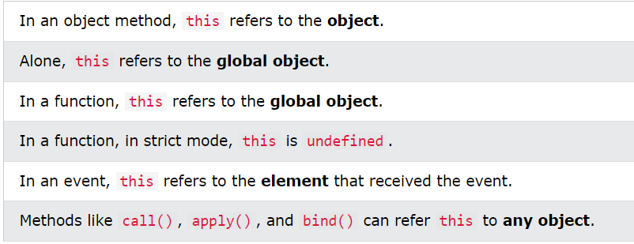
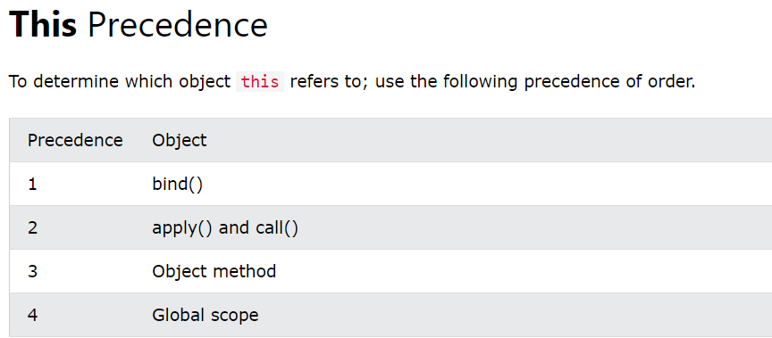
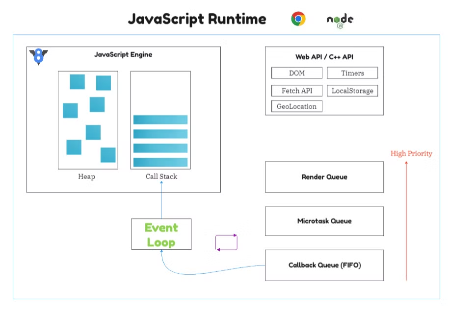

# Topics

- This Keyword
- Asynchronous JavaScript
- JS Web APIs
- JS vs JQuery

 

  
<h2 style="display: inline;"><a href="https://www.w3schools.com/js/js_this.asp" target="_blank">This Keyword</a></h2>

 

- In JavaScript, the this keyword refers to an object.
- The this keyword refers to **different objects** depending on how it is used.

 

 

  
<h2 style="display: inline;"><a href="https://www.w3schools.com/js/js_callback.asp" target="_blank">Asynchronous JavaScript</a></h2>

 

- Program execution happens in Call Stack
- Memory allocation happens in Memory Heap
- JS Engine is inside JS Runtime
- We get asynchronous behavior due to Web API inside Runtime
- JS is synchronous, but it can do asynchronous task due to Runtime, especially for Web API

 

## References

- https://www.w3schools.com/js/default.asp
