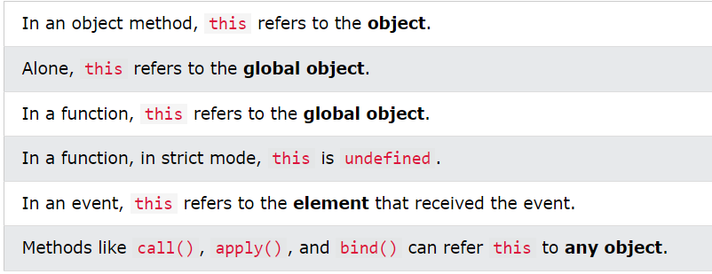
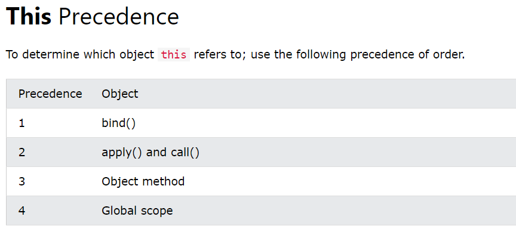
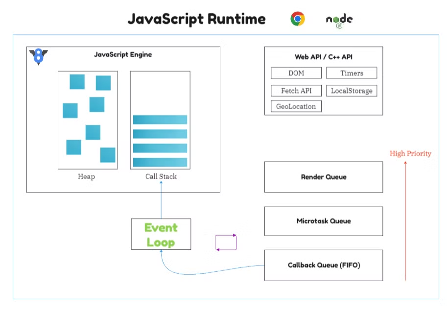

# Topics

- This Keyword
- Asynchronous JavaScript

  - Callback
  - Asynchronous
  - Promises
  - async/await

- JS Web APIs
  - Forms API
  - History API
  - Storage API
  - Worker API
  - Fetch API
  - Geolocation API
- JS vs JQuery

<br>

<details>
  <summary><h2 style="display: inline;"><a href="https://www.w3schools.com/js/js_this.asp" target="_blank">This Keyword</a></h2></summary>
<br>

- In JavaScript, the this keyword refers to an object.
- The this keyword refers to **different objects** depending on how it is used.



<br>



</details>
<br>

<details>
  <summary><h2 style="display: inline;"><a href="https://www.w3schools.com/js/js_callback.asp" target="_blank">Asynchronous JavaScript</a></h2></summary>
<br>



- Program execution happens in Call Stack
- Memory allocation happens in Memory Heap
- JS Engine is inside JS Runtime
- We get asynchronous behavior due to Web API inside Runtime
- JS is synchronous, but it can do asynchronous task due to Runtime, especially for Web API.

Callback => Promise => Async/Await

- "async and await make promises easier to write"
- async makes a function return a Promise
- await makes a function wait for a Promise

<a href="https://www.freecodecamp.org/news/asynchronous-programming-in-javascript-examples/?ref=dailydev" target="_blank">Asynchronous Programming in JavaScript – Callbacks, Promises, & Async/Await Examples</a>

```js
// asynchronous example code
```

Promise methods

</details>
<br>

<details>
  <summary><h2 style="display: inline;"><a href="https://www.w3schools.com/js/js_api_intro.asp?goalId=75e13f34-a8d9-4e12-8fdf-47f4abaab487" target="_blank">Web APIs</a></h2></summary>
<br>

- A Web API is an application programming interface for the Web.
- It can greatly simplify complex functions.
- It can provide easy syntax to complex code.

### Web Storage API

- The data is stored with no expiration date, and will not be deleted when the browser is closed.
- The difference is that the sessionStorage object stores data for one session. The data is deleted when the browser is closed.

### Web Workers and the DOM

- Normally web workers are not used for simple scripts, but for more **CPU intensive** tasks.

<a href="https://softwareg.com.au/blogs/computer-hardware/cpu-intensive-vs-io-intensive" target="_blank">CPU Intensive Vs IO Intensive
</a>

- Since web workers are in external files, they do not have access to the following JavaScript objects:
  - The window object
  - The document object
  - The parent object

<br>

</details>
<br>

<details>
  <summary><h2 style="display: inline;"><a href="https://www.w3schools.com/js/js_jquery_selectors.asp" target="_blank">JS vs JQuery</a></h2></summary>
<br>

- jQuery was created in 2006 by John Resig. It was designed to handle Browser Incompatibilities and to simplify HTML DOM Manipulation, Event Handling, Animations, and Ajax.

- For more than 10 years, jQuery has been the most popular **JavaScript library** in the world.
- However, after JavaScript Version 5 (2009), most of the jQuery utilities can be solved with a few lines of standard JavaScript.

</details>
<br>

## References

- https://www.w3schools.com/js/default.asp
