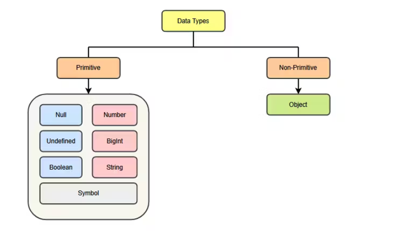
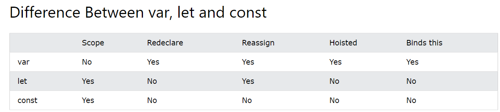

# Topics

- JavaScript Introduction
- Scope, Hoisting
- Variables, Data Types
- Strings
- Clean Coding
- Higher Order Function
  <br>

<details>
  <summary><h2 style="display: inline;"><a href="https://www.w3schools.com/js/js_intro.asp?goalId=75e13f34-a8d9-4e12-8fdf-47f4abaab487" target="_blank">Introduction</a></h2></summary>
<br>

- JavaScript was invented by <b>Brendan Eich</b> in 1995, and became an ECMA standard in 1997.
- <strong>ECMA-262</strong> is the official name of the standard.
- <strong>ECMAScript</strong> is the official name of the language.
- JavaScript uses the Unicode character set. Unicode covers (almost) all the characters, punctuations, and symbols in the world.
  <br>

### What can JavaScript do?

- JavaScript can change HTML Content
- JavaScript can change HTML Attribute Values
- JavaScript can change HTML Styles (CSS)
- JavaScript can hide HTML Elements
- JavaScript can show HTML Elements
  <br>

### How to use JavaScript?

- In HTML, JavaScript code is inserted between `<script>` and `</script>` tags.

```js
<script>
	document.getElementById("demo").innerHTML = "My First JavaScript";
<script>
```

Old JavaScript examples may use a type attribute: `<script type="text/javascript">`.
The type attribute is not required. JavaScript is the default scripting language in HTML.

- Scripts can be placed in the <body>, or in the <head> section of an HTML page, or in both.
- Placing scripts at the bottom of the <body> element improves the display speed, because script interpretation slows down the display.
- External JavaScript. `<script src="myScript.js"></script>`
  <br>

### JavaScript Output

JavaScript can "display" data in different ways:

- Writing into an HTML element, using `innerHTML`.
- Writing into the HTML output using `document.write()`.
- Writing into an alert box, using `window.alert()`.
- Writing into the browser console, using `console.log()`.
  <br>

### JavaScript Comments

```js
//document.getElementById("myH").innerHTML = "My First Page";
document.getElementById("myP").innerHTML = "My first paragraph.";

/*
document.getElementById("myH").innerHTML = "My First Page";
document.getElementById("myP").innerHTML = "My first paragraph.";
*/
```

</details>
<br>

<details>
  <summary><h2 style="display: inline;"><a href="https://www.w3schools.com/js/js_variables.asp?goalId=75e13f34-a8d9-4e12-8fdf-47f4abaab487" target="_blank">Variables, Let, Const & Data Types
</a></h2></summary>
<br>

- Variables are Containers for Storing Data
- JavaScript Variables can be declared in 4 ways:
  - Automatically
  - Using var
  - Using let
  - Using const
    <br>

### JavaScript Identifiers

- All JavaScript variables must be identified with unique names. These unique names are called **identifiers**.

- Identifiers can be short names (like x and y) or more descriptive names (age, sum, totalVolume).

- The general rules for constructing names for variables (unique identifiers) are:

  - Names can contain letters, digits, underscores, and dollar signs.
  - Names must begin with a letter.
  - Names can also begin with $ and \_
  - Names are case sensitive (y and Y are different variables).
  - Reserved words (like JavaScript keywords) cannot be used as names.
    
    <br>

### JavaScript Dollar Sign $

```js
let $ = "Hello World";
let $$$ = 2;
let $myMoney = 5;
```

Using the dollar sign is not very common in JavaScript, but professional programmers often use it as an alias for the main function in a JavaScript library.

### JavaScript Underscore (\_)

```js
let _lastName = "Johnson";
let _x = 2;
let _100 = 5;
```

Using the underscore is not very common in JavaScript, but a convention among professional programmers is to use it as an alias for "private (hidden)" variables.

### Re-Declaring JavaScript Variables

- If you re-declare a JavaScript variable declared with `var`, it will not lose its value.
- Redeclaring a variable with `const`, `let`, in another scope, or in another block, is allowed:

```js
const x = 2; // Allowed

{
	const x = 3; // Allowed
}

{
	const x = 4; // Allowed
}
```

```js
var carName = "Volvo";
var carName;
```

### JavaScript Arithmetic

```js
let a = 5 + 2 + 3; // 10
let b = "John" + " " + "Doe"; // John Doe

let c = "5" + 2 + 3; // '523'  If you put a number in quotes, the rest of the numbers will be treated as strings, and concatenated.
let d = 2 + 3 + "5"; // '55'
```

<br>

### Example

```js
var a = 6;
function f() {
	console.log("Inside function ", a);
}

console.log("Outside function ", a);

f();
```

```js
let a = 6;
function f() {
	console.log("Inside function ", a);
}

console.log("Outside function ", a);

f();
```

### When to use var, let, or const?

- Always declare variables
- Always use `const` if the value should not be changed
- Always use `const` if the type should not be changed (Arrays and Objects)
- Only use `let` if you can't use `const`
- Only use `var` if you MUST support old browsers.
  <br>


<br>

</details>
<br>
<details>
  <summary><h2 style="display: inline;"><a href="https://www.w3schools.com/js/js_scope.asp?goalId=75e13f34-a8d9-4e12-8fdf-47f4abaab487" target="_blank">Scope, Hoisting
</a></h2></summary>
<br>

- Scope determines the accessibility (visibility) of variables.
- In JavaScript, objects and functions are also variables.
- Scope determines the accessibility of **variables**, **objects**, and **functions** from different parts of the code.
- JavaScript variables have 3 types of scope
  - `Block scope`
  - `Function scope`
  - `Global scope`
    <br>

```js
// Automatically Global

myFunction();

// code here can use carName

function myFunction() {
	carName = "Volvo";
}
```

⚠️ Do NOT create global variables unless you intend to.
⚠️ Global variables (or functions) can overwrite window variables (or functions).
⚠️ Any function, including the window object, can overwrite global variables and functions.

- With JavaScript, the global scope is the JavaScript environment.
  - In HTML, the global scope is the `window` object.
  - Global variables defined with the `var` keyword belong to the window object
  - Global variables defined with the `let` keyword do not belong to the window object

#### The Lifetime of JavaScript Variables

- The lifetime of a JavaScript variable starts when it is declared.

- Function (local) variables are deleted when the function is completed.

- In a web browser, global variables are deleted when you close the browser window (or tab).

#### Examples

```js
// var has no Block scope. var has function scope.

{
	var x = 2;
}
// x CAN be used here
```

```js
// If you assign a value to a variable that has not been declared, it will automatically become a GLOBAL variable.
// Your global variables (or functions) can overwrite window variables (or functions).

console.log(x); // undefined
var x = 23;
console.log(x); // 23

function myFunc() {
	x = 10;
	console.log(`${x} from myFunc()`); // 10 from myFunc()
}

myFunc();
console.log(x); // 10
```

```js
// Variables declared with var are in the function scope.

console.log(x); // undefined
var x = 23;
console.log(x); // 23

function myFunc() {
	var x = 10; // It will create another new variable which is different from GLOBAL x = 23. Here var x = 10 -> accessibility exist within myFunc()
	console.log(`${x} from myFunc()`); // 10 from myFunc()
}

myFunc();
console.log(x); // 23
```

<br>

### Hoisting

- Hoisting is JavaScript's default behavior of moving all declarations (**variable** and **function** declarations) to the top of the current scope.
- - Variables defined with `var` is hoisted to the top of the block, but initialized with `undefined`.
- Variables defined with `let` and `const` are hoisted to the top of the block, but not *initialized*.
  Meaning: The block of code is aware of the variable, but it cannot be used until it has been declared.

- Using a `let` variable before it is declared will result in a `ReferenceError`.

- The variable is in a "temporal dead zone" from the start of the block until it is declared

- Using a `const` variable before it is declared, is a `syntax error`, so the code will simply not run
  <br>

**<span style="color:orange;">Tips</span>**: Declare Variables at the Top!

- If a developer doesn't understand hoisting, programs may contain bugs (errors).

- To avoid bugs, always declare all variables at the beginning of every scope.

- JavaScript in **strict mode `“use strict”`** does not allow variables to be used if they are not declared.

- The "use strict" directive is only recognized at the **beginning** of a script or a function.

### Example

```js
console.log(x); // undefined
x = 8;
console.log(x); // 8
var x;
```

```js
console.log(x); // undefined
x = 8;
console.log(x); // 8
var x = 6;
console.log(x); // 6
```

```js
// ReferenceError: x is not defined
x = 8;
console.log(x);
let x;
```

```js
// SyntaxError: Missing initializer in const declaration
x = 8;
console.log(x);
const x;
```

```js
// ReferenceError: x is not defined
console.log(x);
x = 8;
console.log(x);
const x = 5;
```

<br>
</details>

### Clean Coding

- Add a semicolon at the end of each executable statement.

```js
let a, b, c; // Declare 3 variables
a = 5; // Assign the value 5 to a
b = 6; // Assign the value 6 to b
c = a + b; // Assign the sum of a and b to c
```

- When separated by semicolons, multiple statements on one line are allowed.

```js
a = 5;
b = 6;
c = a + b;
```

- Ending statements with semicolon is not required, but highly recommended.
- JavaScript ignores multiple spaces. You can add white space to your script to make it more readable.

```js
let person = "Hege";
let person = "Hege";
```

- A good practice is to put spaces around operators ( = + - \* / )

```js
let x = y + z;
```

- For best readability, programmers often like to avoid code lines longer than 80 characters.

If a JavaScript statement does not fit on one line, the best place to break it is after an operator.

```js
document.getElementById("demo").innerHTML = "Hello Dolly!";
```

- JavaScript keywords are reserved words. Reserved words cannot be used as names for variables.

## References

- https://www.w3schools.com/js/default.asp

🔼 [Back to Top](#topics)
